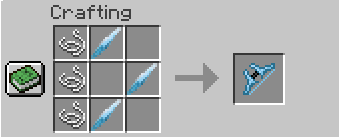
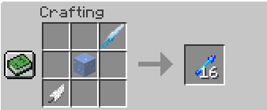
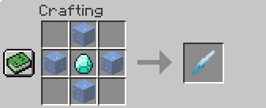
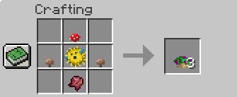
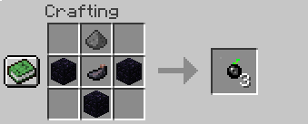

# League of Legend Mod

This is a Minecraft 1.12.2 Mod inspired by the game Leauge of Legends by Riot Games
The main idea of this mod is to add champion weapons or significant things about a champion to Minecraft

## Current Items

* Avarosa's Bow - Ashe's Bow
	* Ice Crystal - Used to make arrow and bow
	* Avarosa's arrow - Special arrow for Avarosa's bow; applies slowness 2 for 2 seconds and 2% to apply slowness 100 for 4 secods

* Noxious Trap
    * Teemo mushrooms; disappear after an entity walks on it and applies slowness 4, poison 4, and nausea 4.

* Smoke Bomb
    * Akail's smoke bomb; Create a temporary shroud that gives invisibility and speed while inside the shroud.

## Crafting Recipe

Avarosa's Bow

Avarosa's Arrow

Ice Crystal

Noxious Trap

Smoke Bomb

